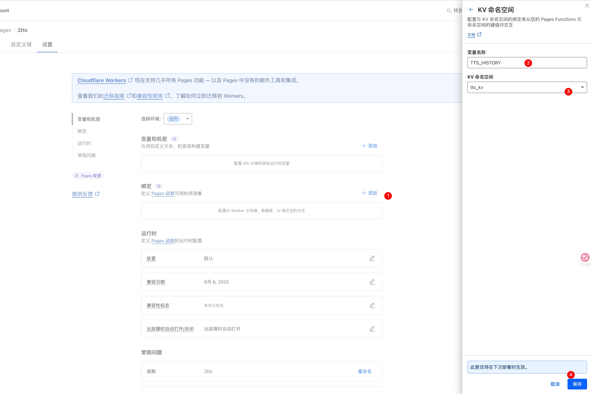

# CF-TTS Proxy Server (v1.1)

A high-performance Text-to-Speech (TTS) proxy service deployed on Cloudflare Pages. It cleverly wraps Microsoft Edge's powerful and natural speech synthesis service into an OpenAI API-compatible interface. This allows developers to seamlessly integrate various existing applications with this free, high-quality TTS service.

Project Features: **Single-file deployment** with complete WebUI testing interface and TTS service.

## 📦 Version Release

### v1.1 Release Package

- **`cf-tts_v1.1.zip`** - Complete v1.1 release package with all necessary files
- **`_worker.js`** - Core service file containing complete server-side logic and embedded WebUI

**Recommended Usage**: Download directly from [v1.1 Release](https://github.com/samni728/edgetts-cloudflare-workers-webui/releases/tag/v1.1) for deployment, or use the `_worker.js` file separately.

### 🆕 v1.1 Update Content

- **🐛 Fixed line break processing bug**: Resolved logical errors in text cleaning function for line break retention/removal
- **📦 Optimized deployment package**: Contains only `_worker.js` file, suitable for direct Cloudflare Pages deployment
- **⚡ File size optimization**: 9.6KB (70% compression ratio)
- **🗄️ History storage**: New KV storage functionality, automatically saves TTS generation history
- **🔗 Sharing functionality**: Supports generating share links with optional password protection
- **🔐 API key verification**: Enhanced security, requires API key to access service
- **📱 History page**: New `/history` page for viewing and managing history records
- **🎵 Audio sharing page**: New `/share/{id}` page for sharing audio content

---

## ✨ Feature Highlights

- **🚀 OpenAI Compatible**: Fully simulates OpenAI's `/v1/audio/speech` interface, can be directly called by official OpenAI SDK or any existing tools.
- **🗣️ High-Quality Voices**: Utilizes various natural and fluent neural network voices provided by Microsoft Edge TTS.
- **🌊 Streaming Support**: Supports both **streaming** and **standard** (non-streaming) response modes, streaming responses can significantly reduce first-play latency for long texts.
- **🧠 Smart Text Cleaning**: Built-in powerful "text cleaning pipeline" that automatically processes messy text copied from PDFs or web pages:
  - Remove Markdown formatting.
  - Remove Emoji expressions.
  - Remove URL links.
  - Remove citation marker numbers in papers or documents (like `...text 1.`), while preserving meaningful numbers (like years, quantities).
  - Remove all excess spaces and hard line breaks, ensuring natural and coherent Chinese listening experience.
  - Support custom keyword filtering.
- **🎛️ Flexible Parameter Configuration**: Supports dynamic adjustment of all core parameters through API requests, including voice, speed, pitch, chunk size, concurrency, and all cleaning options.
- **🌐 Zero-dependency Deployment**: Script is completely self-contained, optional KV storage configuration, extremely simple deployment process.
- **💻 Convenient Testing Tools**: Provides a feature-rich WebUI, allowing users to test all functions without writing any code.
- **🗄️ Smart History Records**: Automatically saves all TTS generation records, supports viewing, managing, and sharing.
- **🔗 One-click Sharing**: Generate share links with password protection, convenient for sharing audio content with others.
- **🔐 Secure Access Control**: Supports API key verification, ensuring secure and reliable service.

---

## 🚀 How It Works?

This Worker script acts as an intelligent "middleman".

1. **Receive Requests**: It receives a `POST` request with exactly the same format as OpenAI TTS API.
2. **Text Preprocessing**: It immediately runs a powerful text cleaning pipeline to purify input text for optimal listening experience.
3. **Smart Decision Making**: It quickly estimates the resources needed to process the text.
   - **Short Text**: If text length is within safe range, it uses the most efficient "direct synchronous mode" for processing.
   - **Long Text**: If text length might trigger Cloudflare platform limits, it automatically enables "self-regulation mechanism", recalculating and adjusting chunking strategy to ensure 100% task success.
4. **Chunking and Concurrency**: It splits the processed text into small chunks and sends requests to Microsoft Edge TTS servers in batches based on your specified concurrency.
5. **Return Results**:
   - **Standard Mode**: Wait for all audio chunks to return, concatenate into a complete MP3 file and return at once.
   - **Streaming Mode**: Start sending data to client immediately upon receiving the first audio chunk, achieving low-latency playback.

---

## Deployment Guide

Deploying this service is very simple, taking only a few minutes.

### Prerequisites

- A Cloudflare account (free version is sufficient)

### Step 1: Create Cloudflare Pages Project

1. Log in to your [Cloudflare Dashboard](https://dash.cloudflare.com)
2. In the left menu, find and click **Workers and Pages**
3. Click **Create Application** → **Pages** → **Upload Assets**
4. Specify a name for your project (e.g., `my-edge-tts`)

#### Deployment Method Selection

**Method 1: Using Release Package (Recommended)**

- Download the release package from [v1.1 Release](https://github.com/samni728/edgetts-cloudflare-workers-webui/releases/tag/v1.1)
- Drag and drop the downloaded zip file directly in Cloudflare Pages WebUI
- System will automatically extract and deploy all files

**Method 2: Single File Deployment**

- Upload `_worker.js` file to project root directory
- Ensure the file is in the root directory, not in subfolders

**Method 3: Directory Structure Deployment**

- If you have a complete project directory structure, you can drag and drop the entire directory
- Ensure `_worker.js` file is in the root directory

### Step 2: Configure Environment Variables and KV Storage

#### 2.1 Configure API Key

To ensure API security, you need to set an API key to control access.

1. After project creation, go to project settings page
2. Click **Settings** → **Environment Variables**
3. Add environment variable:
   - **Type**: Select `Secret`
   - **Variable Name**: `API_KEY`
   - **Value**: Enter a key you set yourself (e.g., `sk-my-secret-key-12345`)
   - **Environment**: Select `Production`
4. Click **Add Variable** to complete configuration


_The above image shows the complete process of configuring API_KEY environment variable in Cloudflare Pages. Select "Secret" type, enter variable name "API_KEY" and corresponding value, then click "Add Variable" to complete configuration._

#### 2.2 Configure KV Storage (Optional)

If you need to use history and sharing features, you need to configure KV storage:

1. On project settings page, click **Settings** → **Bindings**
2. Click **+ Add** button
3. Select **KV Namespace**
4. Configure KV binding:
   - **Variable Name**: `TTS_HISTORY`
   - **KV Namespace**: Select or create a KV namespace (e.g., `tts_kv`)
5. Click **Save** to complete configuration



_The above image shows the complete process of configuring KV storage in Cloudflare Pages. Add KV namespace in bindings page, set variable name to "TTS_HISTORY", and select corresponding KV namespace._

**Important Notes**:

- API key cannot be viewed again once saved, please keep it safe
- Recommend using complex random strings as keys
- This key will be used for subsequent API call authentication
- KV storage is used to save history records and sharing data, without configuration these features will be unavailable

⚠️ **Critical Reminder**: After setting or modifying environment variables, **you must redeploy once** for changes to take effect!

### Step 3: Deploy

1. Return to project homepage
2. Click **Create New Deployment**
3. After confirming files are uploaded correctly, click **Save and Deploy**
4. Deployment complete

**Redeployment Instructions**:

- After each environment variable modification, redeployment is required
- Click **Create New Deployment** or **Redeploy** on project homepage
- Ensure correct environment is selected (Production)
- New environment variables will take effect after deployment completion

### Step 4: Access and Use

1. **Access WebUI**: Open `https://your-project-name.pages.dev/`
2. **Configure API Key**: Enter your set key in the "API Configuration" section of the page
3. **Start Using**: You can now test TTS functionality directly on the webpage!

#### New Feature Usage Instructions

- **History Page**: Visit `https://your-project-name.pages.dev/history` to view all TTS generation history
- **Sharing Feature**: Click "Share" button on history page to generate share links and set passwords
- **Share Page**: Visit `https://your-project-name.pages.dev/share/{id}` to view shared audio content
- **API Key Verification**: All API requests need to include `Authorization: Bearer YOUR_API_KEY` in request headers

### ⚠️ Important Notes

**Issues that may occur during first deployment**:

- **502 Error** may appear immediately after deployment
- This is normal as Cloudflare needs time to initialize the service
- **Solution**: Wait 1-2 minutes, or refresh the page several times
- This issue won't occur again after service stabilizes

---

## 🛠️ API Usage Guide

### Endpoints

#### TTS Service Endpoints

- `POST https://your-project-name.pages.dev/v1/audio/speech` - Generate speech
- `GET https://your-project-name.pages.dev/v1/models` - Get available models

#### New Feature Endpoints

- `GET https://your-project-name.pages.dev/history` - History page
- `GET https://your-project-name.pages.dev/share/{id}` - Share page
- `POST https://your-project-name.pages.dev/api/save` - Save TTS to history
- `GET https://your-project-name.pages.dev/api/history` - Get history API
- `POST https://your-project-name.pages.dev/api/set-password` - Set share password
- `DELETE https://your-project-name.pages.dev/api/delete` - Delete history record
- `GET https://your-project-name.pages.dev/api/audio/{id}` - Get audio file

### Authentication

Use `Bearer Token` authentication method. Put your API Key in the `Authorization` request header.

`Authorization: Bearer YOUR_API_KEY`

### Request Body Parameters (`JSON`)

| Parameter                   | Type      | Default      | Description                                                                                                                    |
| --------------------------- | --------- | ------------ | ------------------------------------------------------------------------------------------------------------------------------ |
| `model`                     | `string`  | `"tts-1"`    | Model ID. Standard format: `tts-1`, `tts-1-hd`. Compatible format: `tts-1-alloy`, etc.                                         |
| `input`                     | `string`  | **Required** | Text to be converted to speech. **Supports any length**.                                                                       |
| `voice`                     | `string`  | `"alloy"`    | Voice selection. Supports OpenAI format (`shimmer`, `alloy`, `fable`, `onyx`, `nova`, `echo`) or Microsoft native voice names. |
| `speed`                     | `number`  | `1.0`        | Speech rate. Range from 0.25 to 2.0.                                                                                           |
| `pitch`                     | `number`  | `1.0`        | Pitch. Range from 0.5 to 1.5.                                                                                                  |
| `style`                     | `string`  | `"general"`  | Voice style. Supports `cheerful`, `sad`, `angry`, `friendly` and 14 other styles.                                              |
| `role`                      | `string`  | `""`         | Role play. Supports `Girl`, `Boy`, `YoungAdultFemale` and 8 other roles.                                                       |
| `styleDegree`               | `number`  | `1.0`        | Style intensity. Range from 0.01 to 2.0, controls the intensity of voice style.                                                |
| `stream`                    | `boolean` | `false`      | Whether to use streaming response. Set to `true` to significantly reduce first-play latency for long texts.                    |
| `concurrency`               | `number`  | `10`         | Number of concurrent requests. Controls how many text chunk requests are sent to Microsoft servers simultaneously.             |
| `chunk_size`                | `number`  | `300`        | Text chunk size (character count). Worker will automatically adjust this value based on platform limits to ensure success.     |
| `cleaning_options`          | `object`  | `{...}`      | An object containing text cleaning switches.                                                                                   |
| `├ remove_markdown`         | `boolean` | `true`       | Whether to remove Markdown formatting.                                                                                         |
| `├ remove_emoji`            | `boolean` | `true`       | Whether to remove Emoji.                                                                                                       |
| `├ remove_urls`             | `boolean` | `true`       | Whether to remove URLs.                                                                                                        |
| `├ remove_line_breaks`      | `boolean` | `false`      | Whether to remove all line breaks.                                                                                             |
| `├ remove_citation_numbers` | `boolean` | `true`       | Whether to intelligently remove citation markers.                                                                              |
| `├ custom_keywords`         | `string`  | `""`         | Custom keywords to remove, separated by commas.                                                                                |

### 🎵 Voice Selection Guide

#### OpenAI Compatible Voices

- `shimmer` - Gentle female voice (zh-CN-XiaoxiaoNeural)
- `alloy` - Professional male voice (zh-CN-YunyangNeural)
- `fable` - Passionate male voice (zh-CN-YunjianNeural)
- `onyx` - Lively female voice (zh-CN-XiaoyiNeural)
- `nova` - Sunny male voice (zh-CN-YunxiNeural)
- `echo` - Northeastern female voice (zh-CN-liaoning-XiaobeiNeural)

**💡 Custom Voice Mapping**: You can modify the `OPENAI_VOICE_MAP` object in the `_worker.js` file to customize voice mapping relationships:

```javascript
const OPENAI_VOICE_MAP = {
  shimmer: "zh-CN-XiaoxiaoNeural", // Can be changed to other Microsoft voices
  alloy: "zh-CN-YunyangNeural", // Can be changed to other Microsoft voices
  fable: "zh-CN-YunjianNeural", // Can be changed to other Microsoft voices
  onyx: "zh-CN-XiaoyiNeural", // Can be changed to other Microsoft voices
  nova: "zh-CN-YunxiNeural", // Can be changed to other Microsoft voices
  echo: "zh-CN-liaoning-XiaobeiNeural", // Can be changed to other Microsoft voices
};
```

Changes require redeployment to take effect.

#### Microsoft Native Voices (Recommended)

**Female Voice Series:**

- `zh-CN-XiaoxiaoNeural` - Xiaoxiao, gentle female voice
- `zh-CN-XiaoyiNeural` - Xiaoyi, lively female voice
- `zh-CN-XiaochenNeural` - Xiaochen, intellectual female voice
- `zh-CN-XiaohanNeural` - Xiaohan, sweet female voice
- `zh-CN-XiaomengNeural` - Xiaomeng, fresh female voice
- `zh-CN-XiaomoNeural` - Xiaomo, elegant female voice
- `zh-CN-XiaoqiuNeural` - Xiaoqiu, mature female voice
- `zh-CN-XiaoruiNeural` - Xiaorui, wise female voice
- `zh-CN-XiaoshuangNeural` - Xiaoshuang, crisp female voice
- `zh-CN-XiaoxuanNeural` - Xiaoxuan, elegant female voice
- `zh-CN-XiaoyanNeural` - Xiaoyan, sweet female voice
- `zh-CN-XiaoyouNeural` - Xiaoyou, young girl voice
- `zh-CN-XiaozhenNeural` - Xiaozhen, gentle female voice

**Male Voice Series:**

- `zh-CN-YunxiNeural` - Yunxi, sunny male voice
- `zh-CN-YunyangNeural` - Yunyang, professional male voice
- `zh-CN-YunjianNeural` - Yunjian, passionate male voice
- `zh-CN-YunfengNeural` - Yunfeng, steady male voice
- `zh-CN-YunhaoNeural` - Yunhao, magnetic male voice
- `zh-CN-YunyeNeural` - Yunye, natural male voice

### cURL Examples

#### 1. Standard OpenAI Format (Recommended)

```bash
curl -X POST "https://your-project-name.pages.dev/v1/audio/speech" \
     -H "Content-Type: application/json" \
     -H "Authorization: Bearer YOUR_API_KEY" \
     -d '{
         "model": "tts-1",
         "voice": "shimmer",
         "input": "Hello, world! This is a speech synthesis request using OpenAI standard format.",
         "response_format": "mp3"
     }' --output standard.mp3
```

#### 2. Streaming Request (For Long Text)

```bash
curl -X POST "https://your-project-name.pages.dev/v1/audio/speech" \
     -H "Content-Type: application/json" \
     -H "Authorization: Bearer YOUR_API_KEY" \
     -d '{
         "model": "tts-1",
         "voice": "nova",
         "input": "This is an example of a streaming request. For longer texts, you can hear the beginning of the voice much faster.",
         "stream": true
     }' --output streaming.mp3
```

#### 3. Using Advanced Filtering Options

```bash
curl -X POST "https://your-project-name.pages.dev/v1/audio/speech" \
     -H "Content-Type: application/json" \
     -H "Authorization: Bearer YOUR_API_KEY" \
     -d '{
         "model": "tts-1",
         "voice": "shimmer",
         "input": "This text contains **Markdown** 1, a link https://example.com and an emoji 😂.",
         "cleaning_options": {
             "remove_markdown": true,
             "remove_urls": true,
             "remove_emoji": true,
             "remove_citation_numbers": true,
             "custom_keywords": "test,example"
         }
     }' --output cleaned.mp3
```

#### 4. Custom Voice Configuration (Advanced Features)

```bash
curl -X POST "https://your-project-name.pages.dev/v1/audio/speech" \
     -H "Content-Type: application/json" \
     -H "Authorization: Bearer YOUR_API_KEY" \
     -d '{
         "model": "tts-1",
         "voice": "zh-CN-XiaoxiaoNeural",
         "input": "Hello, this is speech synthesis using Microsoft native voice and advanced configuration.",
         "style": "cheerful",
         "role": "YoungAdultFemale",
         "styleDegree": 1.5,
         "speed": 1.2,
         "pitch": 1.1
     }' --output advanced.mp3
```

#### 5. Compatible with Legacy Format (Backward Compatible)

```bash
curl -X POST "https://your-project-name.pages.dev/v1/audio/speech" \
     -H "Content-Type: application/json" \
     -H "Authorization: Bearer YOUR_API_KEY" \
     -d '{
         "model": "tts-1-shimmer",
         "input": "This is a legacy format request that still works normally."
     }' --output compatible.mp3
```

---

## ⚠️ Important Limitations

- **Character Limit**: This version of the script is designed to run stably on **Cloudflare Free Plan**. To ensure this, there is an implicit upper limit for single request text length, approximately **120,000 characters** (`~50 * 2500`). This is completely sufficient for the vast majority of application scenarios (including converting entire long articles). Beyond this length, the API will return a clear error message.

---

## 📄 Project File Description

- **`cf-tts_v1.1.zip`**: v1.1 complete deployment package with all necessary files
- **`_worker.js`**: Core service file containing complete server-side logic and embedded WebUI. Integrates API routing, authentication, text cleaning, Android App simulated TTS calls, history storage, sharing functionality, and feature-complete testing interface
- **`API_KEY.jpg`**: Configuration example image showing how to set API_KEY environment variable in Cloudflare Pages
- **`TTS_HISTORY.jpg`**: Configuration example image showing how to configure KV storage in Cloudflare Pages

**Deployment Recommendation**: Prioritize using [v1.1 Release](https://github.com/samni728/edgetts-cloudflare-workers-webui/releases/tag/v1.1) release package, or deploy `_worker.js` file separately.

### 🔧 Advanced Custom Configuration

If you need to customize voice mapping or other configurations, you can:

1. **Download Source Code**: Download release package from [v1.1 Release](https://github.com/samni728/edgetts-cloudflare-workers-webui/releases/tag/v1.1)
2. **Modify Configuration**: Edit relevant configurations in `_worker.js` file
3. **Redeploy**: Redeploy modified files to Cloudflare Pages

**Customizable Configuration Items**:

- `OPENAI_VOICE_MAP` - OpenAI voice to Microsoft voice mapping relationships
- `TOKEN_REFRESH_BEFORE_EXPIRY` - Token refresh time
- Other global configuration parameters

## ✨ New Version Features

### 🎯 **Single File Architecture**

- **Integrated Design**: Server + WebUI combined into one
- **Zero Configuration Deployment**: Upload one file to complete deployment
- **Built-in Testing Interface**: Access root path to use complete testing tools

### 🚀 **Enhanced Features**

- **Streaming Response**: Supports real-time audio stream playback, reducing long text latency
- **Smart API Key Management**: Cookie auto-save, configuration panel smart expand/collapse
- **Dynamic cURL Examples**: Automatically generates correct calling examples based on configuration
- **Perfect UI Alignment**: Optimized interface layout and interaction experience
- **GitHub Integration**: Built-in project links and Star button

### 🔧 **Technical Optimizations**

- **Android App Simulation**: Uses verified TTS calling methods
- **Smart Error Handling**: Detailed status prompts and error feedback
- **Responsive Design**: Adapts to various screen sizes
- **Modern UI**: Uses latest CSS and JavaScript features

---
