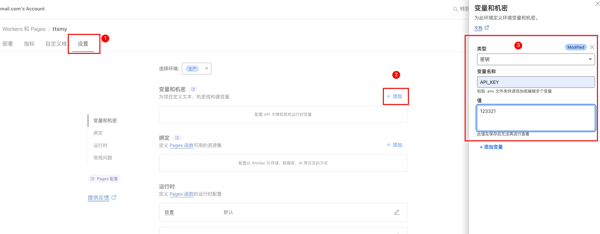
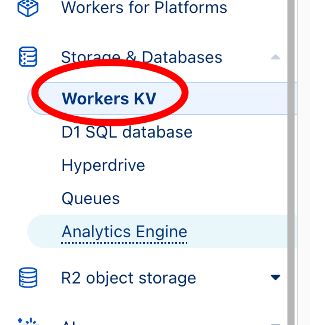
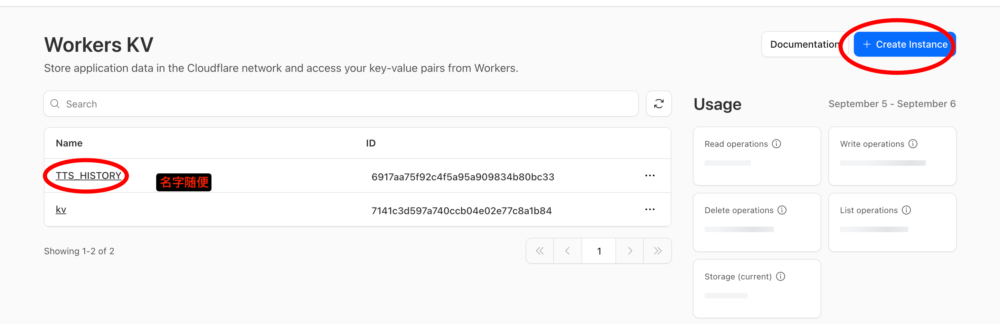
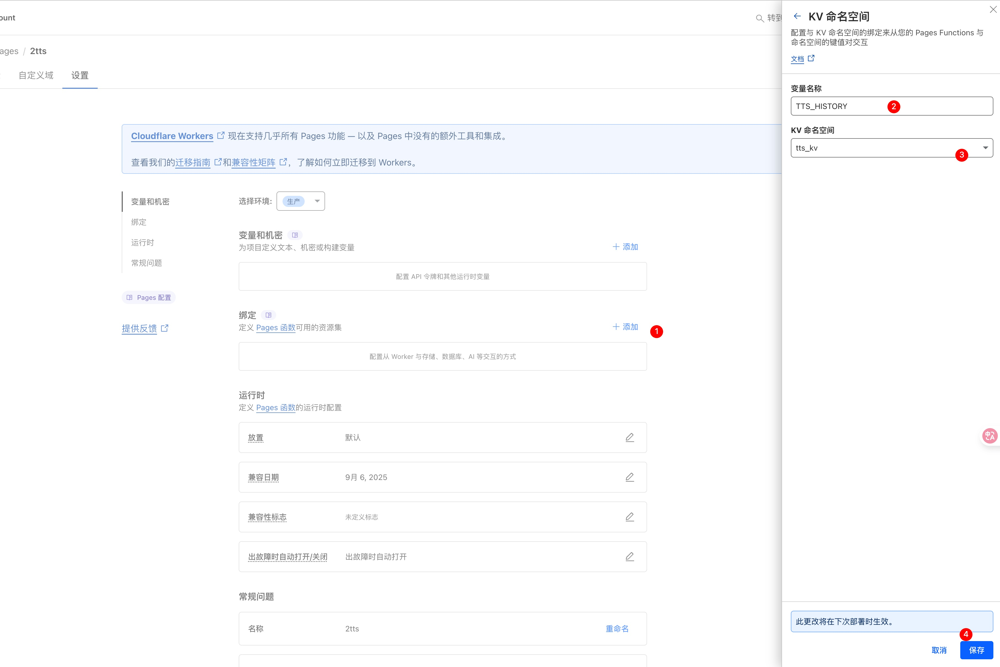
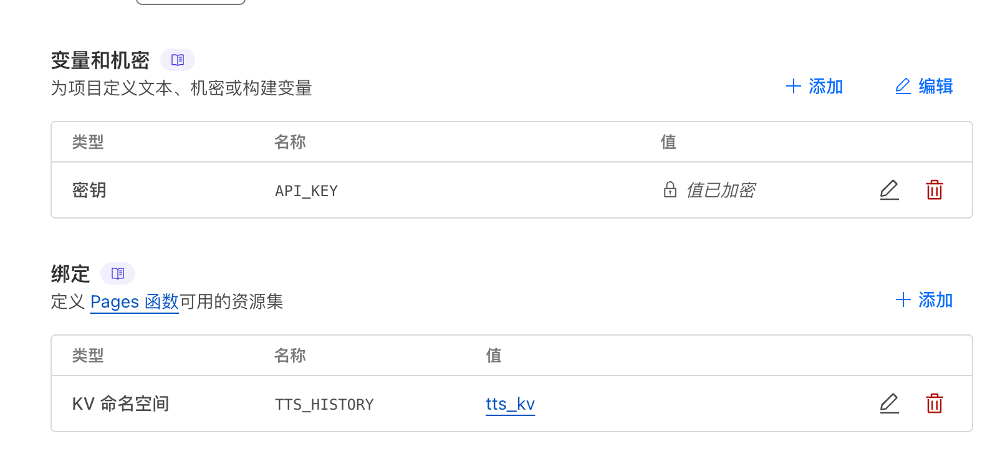

# CF-TTS Proxy Server (v1.1)

一个部署在 Cloudflare Pages 上的高性能文本转语音（TTS）代理服务，将微软 Edge TTS 封装成兼容 OpenAI API 的接口。

## ✨ 主要特性

- **🚀 OpenAI 兼容**: 完全模拟 OpenAI 的 `/v1/audio/speech` 接口
- **🗣️ 高质量音色**: 利用微软 Edge TTS 的自然神经网络语音
- **⚡ 流式播放**: 支持流式和标准两种响应模式，降低长文本延迟
- **🧠 智能文本清理**: 自动处理 Markdown、Emoji、URL、引用标记等
- **🗄️ 历史记录**: 自动保存 TTS 生成历史，支持分享和密码保护
- **🔐 安全访问**: API 密钥验证，确保服务安全
- **💻 内置 WebUI**: 功能完整的测试界面，无需编程即可使用

## 🚀 快速部署

### 1. 创建 Cloudflare Pages 项目

1. 登录 [Cloudflare Dashboard](https://dash.cloudflare.com)
2. 点击 **Workers 和 Pages** → **创建应用程序** → **Pages** → **上传资产**
3. 上传 `_worker.js` 文件到项目根目录

### 2. 配置环境变量

#### 设置 API 密钥

1. 进入项目设置 → **环境变量**
2. 添加环境变量：
   - **类型**: `密钥 (Secret)`
   - **变量名**: `API_KEY`
   - **值**: 输入您的密钥（如 `sk-my-secret-key-12345`）



#### 配置 KV 存储（可选）

如需使用历史记录和分享功能，需要配置 KV 存储：

**步骤 1：创建 KV 命名空间**
1. 在 Cloudflare Dashboard 点击 **Workers 和 Pages** → **KV**
2. 点击 **创建命名空间**
3. 输入名称（如 `tts_kv`）并创建



**步骤 2：绑定 KV 到 Pages 项目**
1. 返回 Pages 项目 → **设置** → **绑定**
2. 点击 **+ 添加** → **KV 命名空间**
3. 配置绑定：
   - **变量名称**: `TTS_HISTORY`
   - **KV 命名空间**: 选择刚创建的命名空间







### 3. 部署和访问

1. 点击 **创建新部署** 完成部署
2. 访问 `https://your-project-name.pages.dev/`
3. 在 WebUI 中输入 API 密钥开始使用

⚠️ **重要**: 修改环境变量后必须重新部署才能生效！

## 🛠️ API 使用

### 基本请求

```bash
curl -X POST "https://your-project-name.pages.dev/v1/audio/speech" \
     -H "Content-Type: application/json" \
     -H "Authorization: Bearer YOUR_API_KEY" \
     -d '{
         "model": "tts-1",
         "voice": "shimmer",
         "input": "你好，世界！",
         "stream": false
     }' --output audio.mp3
```

### 主要参数

| 参数 | 类型 | 默认值 | 说明 |
|------|------|--------|------|
| `model` | string | `"tts-1"` | 模型 ID |
| `input` | string | **必需** | 要转换的文本 |
| `voice` | string | `"alloy"` | 音色选择 |
| `speed` | number | `1.0` | 语速 (0.25-2.0) |
| `pitch` | number | `1.0` | 音调 (0.5-1.5) |
| `stream` | boolean | `false` | 是否流式响应 |
| `cleaning_options` | object | `{...}` | 文本清理选项 |

### 音色选择

#### OpenAI 兼容音色
- `shimmer` - 温柔女声
- `alloy` - 专业男声  
- `fable` - 激情男声
- `onyx` - 活泼女声
- `nova` - 阳光男声
- `echo` - 东北女声

#### 微软原生音色（推荐）
- `zh-CN-XiaoxiaoNeural` - 晓晓，温柔女声
- `zh-CN-YunyangNeural` - 云扬，专业男声
- `zh-CN-YunxiNeural` - 云希，阳光男声

📁 **完整音色列表**: 查看 `tts_list/` 目录中的音色列表文件

### 流式请求示例

```bash
curl -X POST "https://your-project-name.pages.dev/v1/audio/speech" \
     -H "Content-Type: application/json" \
     -H "Authorization: Bearer YOUR_API_KEY" \
     -d '{
         "model": "tts-1",
         "voice": "nova",
         "input": "这是一个长文本示例...",
         "stream": true
     }' --output streaming.mp3
```

## �� 项目文件

- **`_worker.js`**: 核心服务文件，包含完整功能
- **`screenshorts/`**: 配置示例图片
- **`tts_list/`**: 完整音色列表文件

## ⚠️ 限制说明

- **字符数限制**: 单次请求约 12 万字符
- **免费套餐**: 适用于 Cloudflare 免费套餐
- **首次部署**: 可能需要等待 1-2 分钟初始化

## 🔗 相关链接

- [GitHub 项目](https://github.com/samni728/edgetts-cloudflare-workers-webui)
- [v1.1 Release](https://github.com/samni728/edgetts-cloudflare-workers-webui/releases/tag/v1.1)
- [Edge TTS 音色列表](https://learn.microsoft.com/zh-cn/azure/ai-services/speech-service/language-support?tabs=tts#multilingual-voices)
