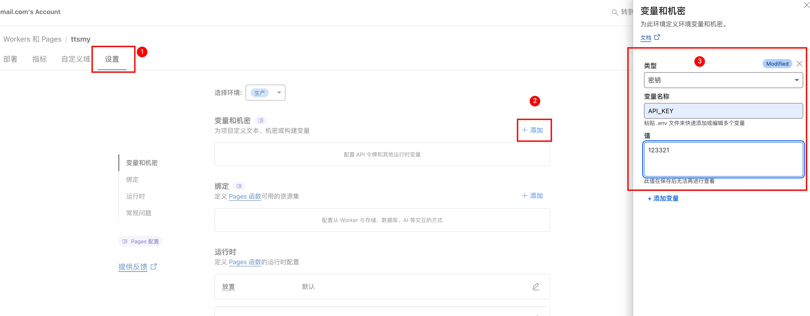

# 高性能 Edge TTS Cloudflare Pages 代理

这是一个部署在 Cloudflare Pages 上的高性能文本转语音（TTS）代理服务。它巧妙地将微软 Edge 强大且自然的语音合成服务，封装成了一个兼容 OpenAI API 格式的接口。这使得开发者可以无缝地将各种现有应用对接到这个免费、高质量的 TTS 服务上。

项目特色：**单文件部署**，包含完整的 WebUI 测试界面和 TTS 服务。

## 📦 版本发布

### v1.0 发布包

- **`cf-tts_v1.zip`** - 完整的 v1.0 版本发布包，包含所有必要文件
- **`_worker.js`** - 核心服务文件，包含完整的服务端逻辑和嵌入式 WebUI
- **`workers.js`** - 备用工作文件

**推荐使用方式**：直接下载 `cf-tts_v1.zip` 进行部署，或单独使用 `_worker.js` 文件。

---

## ✨ 功能亮点

- **🚀 OpenAI 兼容**: 完全模拟 OpenAI 的 `/v1/audio/speech` 接口，可被官方的 OpenAI SDK 或任何现有工具直接调用。
- **🗣️ 高质量音色**: 利用微软 Edge TTS 提供的多种自然、流畅的神经网络语音。
- ** STREAMING**: 支持**流式**和**标准**（非流式）两种响应模式，流式响应可极大降低长文本的首次播放延迟。
- **🧠 智能文本清理**: 内置强大的“文本清理流水线”，可自动处理从 PDF 或网页复制的杂乱文本：
  - 移除 Markdown 格式。
  - 移除 Emoji 表情符号。
  - 移除 URL 链接。
  - 移除论文或文档中的引用标记数字（如 `...文本 1.`），同时保留有意义的数字（如年份、数量）。
  - 移除所有多余的空格和硬换行，确保中文听感自然连贯。
  - 支持自定义关键词过滤。
- **🎛️ 灵活的参数配置**: 支持通过 API 请求动态调整所有核心参数，包括音色、语速、音调、分块大小、并发数以及所有清理选项。
- **🌐 零依赖部署**: 脚本完全自包含，无需配置 KV、队列等任何外部服务，部署过程极其简单。
- **💻 便捷的测试工具**: 提供一个功能丰富的 `webui.html`，让用户无需编写任何代码即可测试所有功能。

---

## 🚀 它是如何工作的？

这个 Worker 脚本扮演了一个智能“中间人”的角色。

1.  **接收请求**: 它接收一个格式与 OpenAI TTS API 完全相同的 `POST` 请求。
2.  **文本预处理**: 它会立即运行强大的文本清理流水线，对输入的文本进行净化，以达到最佳的听感。
3.  **智能决策**: 它会快速预估处理这段文本所需的资源。
    - **短文本**: 如果文本长度在安全范围内，它会采用最高效的“直接同步模式”进行处理。
    - **超长文本**: 如果文本长度可能触发 Cloudflare 的平台限制，它会自动启用“自我调节机制”，重新计算并调整分块策略，以保证任务 100%成功。
4.  **分块与并发**: 它将处理好的文本分割成多个小块，并根据您指定的并发数，分批次地向微软 Edge TTS 服务器发起请求。
5.  **返回结果**:
    - **标准模式**: 等待所有音频块返回，拼接成一个完整的 MP3 文件后一次性返回。
    - **流式模式**: 在收到第一个音频块时就立即开始向客户端发送数据，实现低延迟播放。

---

## 部署指南

部署这个服务非常简单，只需要几分钟。

### 准备工作

- 一个 Cloudflare 账户（免费版即可）

### 步骤一：创建 Cloudflare Pages 项目

1. 登录到您的 [Cloudflare Dashboard](https://dash.cloudflare.com)
2. 在左侧菜单中，找到并点击 **Workers 和 Pages**
3. 点击 **创建应用程序** → **Pages** → **上传资产**
4. 为您的项目指定一个名称（例如 `my-edge-tts`）

#### 部署方式选择

**方式一：使用发布包（推荐）**

- 下载 `cf-tts_v1.zip` 发布包
- 在 Cloudflare Pages 的 WebUI 中直接拖放 `cf-tts_v1.zip` 文件
- 系统会自动解压并部署所有文件

**方式二：单文件部署**

- 上传 `_worker.js` 文件到项目根目录
- 确保文件位于根目录，不要放在子文件夹中

**方式三：目录结构部署**

- 如果您有完整的项目目录结构，可以拖放整个目录
- 确保 `_worker.js` 文件位于根目录

### 步骤二：配置环境变量

为了确保 API 的安全性，您需要设置一个 API 密钥来控制访问权限。

1. 在项目创建后，进入项目设置页面
2. 点击 **设置** → **环境变量**
3. 添加环境变量：
   - **类型**: 选择 `密钥 (Secret)`
   - **变量名**: `API_KEY`
   - **值**: 输入一个您自己设定的密钥（例如 `sk-my-secret-key-12345`）
   - **环境**: 选择 `Production`
4. 点击 **添加变量** 完成配置



_上图展示了在 Cloudflare Pages 中配置 API_KEY 环境变量的完整流程。选择"密钥(Secret)"类型，输入变量名"API_KEY"和对应的值，然后点击"添加变量"即可完成配置。_

**重要提示**：

- API 密钥一旦保存后无法再次查看，请妥善保管
- 建议使用复杂的随机字符串作为密钥
- 这个密钥将用于后续 API 调用的身份验证

⚠️ **关键提醒**：设置或修改环境变量后，**必须重新部署一次**才能生效！

### 步骤三：部署

1. 返回项目主页
2. 点击 **创建新部署**
3. 确认文件上传正确后，点击 **保存并部署**
4. 等待部署完成（通常需要 1-3 分钟）

**重新部署说明**：

- 每次修改环境变量后，都需要重新部署
- 在项目主页点击 **创建新部署** 或 **重新部署**
- 确保选择正确的环境（Production）
- 部署完成后，新的环境变量才会生效

### 步骤四：访问和使用

1. **访问 WebUI**: 打开 `https://your-project-name.pages.dev/`
2. **配置 API Key**: 在页面的"API 配置"部分输入您设置的密钥
3. **开始使用**: 现在可以直接在网页上测试 TTS 功能了！

### ⚠️ 重要提示

**首次部署可能遇到的问题**：

- 部署后立即访问可能会出现 **502 错误**
- 这是正常现象，因为 Cloudflare 需要时间来初始化服务
- **解决方法**：等待 1-2 分钟，或者多刷新几次页面
- 服务稳定后就不会再出现此问题

---

## 🛠️ API 使用指南

### 端点

`POST https://your-project-name.pages.dev/v1/audio/speech`

### 认证

使用 `Bearer Token` 认证方式。将您的 API Key 放在 `Authorization` 请求头中。

`Authorization: Bearer YOUR_API_KEY`

### 请求体参数 (`JSON`)

| 参数 (Parameter)            | 类型 (Type) | 默认值 (Default)         | 描述 (Description)                                                                                    |
| --------------------------- | ----------- | ------------------------ | ----------------------------------------------------------------------------------------------------- |
| `model`                     | `string`    | `"tts-1"`                | 模型 ID。支持 `tts-1`, `tts-1-hd`，或映射的音色如 `tts-1-alloy`。                                     |
| `input`                     | `string`    | **必需**                 | 需要转换为语音的文本。**支持任意长度**。                                                              |
| `voice`                     | `string`    | `"zh-CN-XiaoxiaoNeural"` | 音色选择。支持 OpenAI 格式 (`shimmer`, `alloy`, `fable`, `onyx`, `nova`, `echo`) 或微软原生音色名称。 |
| `speed`                     | `number`    | `1.0`                    | 语速。范围从 0.25 到 2.0。                                                                            |
| `pitch`                     | `number`    | `1.0`                    | 音调。                                                                                                |
| `stream`                    | `boolean`   | `false`                  | 是否使用流式响应。设为 `true` 可极大降低长文本的首次延迟。                                            |
| `concurrency`               | `number`    | `10`                     | 并发请求数。控制同时向微软服务器发送多少个文本块请求。                                                |
| `chunk_size`                | `number`    | `300`                    | 文本分块大小（字符数）。Worker 会根据平台限制自动调整此值以确保成功。                                 |
| `cleaning_options`          | `object`    | `{...}`                  | 一个包含文本清理开关的对象。                                                                          |
| `├ remove_markdown`         | `boolean`   | `true`                   | 是否移除 Markdown 格式。                                                                              |
| `├ remove_emoji`            | `boolean`   | `true`                   | 是否移除 Emoji。                                                                                      |
| `├ remove_urls`             | `boolean`   | `true`                   | 是否移除 URL。                                                                                        |
| `├ remove_line_breaks`      | `boolean`   | `true`                   | 是否移除所有空格和换行符。                                                                            |
| `├ remove_citation_numbers` | `boolean`   | `true`                   | 是否智能移除论文引用标记。                                                                            |
| `├ custom_keywords`         | `string`    | `""`                     | 自定义要移除的关键词，以逗号分隔。                                                                    |

### 🎵 音色选择说明

#### OpenAI 兼容音色

- `shimmer` - 温柔女声 (zh-CN-XiaoxiaoNeural)
- `alloy` - 专业男声 (zh-CN-YunyangNeural)
- `fable` - 激情男声 (zh-CN-YunjianNeural)
- `onyx` - 活泼女声 (zh-CN-XiaoyiNeural)
- `nova` - 阳光男声 (zh-CN-YunxiNeural)
- `echo` - 东北女声 (zh-CN-liaoning-XiaobeiNeural)

#### 微软原生音色 (推荐)

**女声系列：**

- `zh-CN-XiaoxiaoNeural` - 晓晓，温柔女声
- `zh-CN-XiaoyiNeural` - 晓伊，活泼女声
- `zh-CN-XiaochenNeural` - 晓辰，知性女声
- `zh-CN-XiaohanNeural` - 晓涵，甜美女声
- `zh-CN-XiaomengNeural` - 晓梦，清新女声
- `zh-CN-XiaomoNeural` - 晓墨，优雅女声
- `zh-CN-XiaoqiuNeural` - 晓秋，成熟女声
- `zh-CN-XiaoruiNeural` - 晓睿，智慧女声
- `zh-CN-XiaoshuangNeural` - 晓双，清脆女声
- `zh-CN-XiaoxuanNeural` - 晓萱，优雅女声
- `zh-CN-XiaoyanNeural` - 晓颜，甜美女声
- `zh-CN-XiaoyouNeural` - 晓悠，少女音
- `zh-CN-XiaozhenNeural` - 晓甄，温柔女声

**男声系列：**

- `zh-CN-YunxiNeural` - 云希，阳光男声
- `zh-CN-YunyangNeural` - 云扬，专业男声
- `zh-CN-YunjianNeural` - 云健，激情男声
- `zh-CN-YunfengNeural` - 云枫，沉稳男声
- `zh-CN-YunhaoNeural` - 云皓，磁性男声
- `zh-CN-YunyeNeural` - 云野，自然男声

### cURL 示例

#### 1. OpenAI 兼容格式 (推荐)

```bash
curl -X POST "https://your-project-name.pages.dev/v1/audio/speech" \
     -H "Content-Type: application/json" \
     -H "Authorization: Bearer YOUR_API_KEY" \
     -d '{
         "model": "tts-1-shimmer",
         "input": "你好，世界！这是使用 OpenAI 兼容格式的语音合成请求。",
         "voice": "shimmer",
         "response_format": "mp3"
     }' --output standard.mp3
```

#### 2. 流式请求 (用于长文本)

```bash
curl -X POST "https://your-project-name.pages.dev/v1/audio/speech" \
     -H "Content-Type: application/json" \
     -H "Authorization: Bearer YOUR_API_KEY" \
     -d '{
         "model": "tts-1-nova",
         "input": "这是一个流式请求的示例，对于较长的文本，你能更快地听到声音的开头部分。",
         "voice": "nova",
         "stream": true
     }' --output streaming.mp3
```

#### 3. 使用高级过滤选项

```bash
curl -X POST "https://your-project-name.pages.dev/v1/audio/speech" \
     -H "Content-Type: application/json" \
     -H "Authorization: Bearer YOUR_API_KEY" \
     -d '{
         "model": "tts-1-shimmer",
         "input": "这段文本包含 **Markdown** 1、一个链接 https://example.com 和一个表情 😂。",
         "voice": "shimmer",
         "cleaning_options": {
             "remove_markdown": true,
             "remove_urls": true,
             "remove_emoji": true,
             "remove_citation_numbers": true,
             "custom_keywords": "测试,示例"
         }
     }' --output cleaned.mp3
```

#### 4. 微软 Edge TTS 原生格式

```bash
curl -X POST "https://your-project-name.pages.dev/v1/audio/speech" \
     -H "Content-Type: application/json" \
     -H "Authorization: Bearer YOUR_API_KEY" \
     -d '{
         "input": "你好，这是使用微软原生音色的语音合成。",
         "voice": "zh-CN-XiaoxiaoNeural",
         "speed": 1.2,
         "pitch": 1.1
     }' --output microsoft.mp3
```

---

## ⚠️ 重要限制

- **字符数限制**: 此版本的脚本设计为在 **Cloudflare 免费套餐** 上稳定运行。为了保证这一点，对于单次请求的文本长度有一个隐性的上限，大约在 **12 万字符** 左右 (`~50 * 2500`)。对于绝大多数应用场景（包括转化整篇长文）都已经完全足够。超过这个长度，API 会返回一个清晰的错误提示。

---

## 📄 项目文件说明

- **`cf-tts_v1.zip`**: v1.0 完整发布包，包含所有必要文件，推荐直接使用此包进行部署
- **`_worker.js`**: 核心服务文件，包含完整的服务端逻辑和嵌入式 WebUI。集成了 API 路由、认证、文本清理、Android App 模拟的 TTS 调用、以及功能完整的测试界面
- **`workers.js`**: 备用工作文件，提供额外的功能扩展和配置选项
- **`API_KEY.jpg`**: 配置示例图片，展示如何在 Cloudflare Pages 中设置环境变量

**部署建议**：优先使用 `cf-tts_v1.zip` 发布包，或单独部署 `_worker.js` 文件。

## ✨ 新版本特性

### 🎯 **单文件架构**

- **一体化设计**: 服务端 + WebUI 合二为一
- **零配置部署**: 上传一个文件即可完成部署
- **内置测试界面**: 访问根路径即可使用完整的测试工具

### 🚀 **增强功能**

- **流式响应**: 支持实时音频流播放，降低长文本延迟
- **智能 API Key 管理**: Cookie 自动保存，配置面板智能展开/折叠
- **动态 cURL 示例**: 根据配置自动生成正确的调用示例
- **完美 UI 对齐**: 优化的界面布局和交互体验
- **GitHub 集成**: 内置项目链接和 Star 按钮

### 🔧 **技术优化**

- **Android App 模拟**: 使用经过验证的 TTS 调用方法
- **智能错误处理**: 详细的状态提示和错误反馈
- **响应式设计**: 适配各种屏幕尺寸
- **现代化 UI**: 使用最新的 CSS 和 JavaScript 特性

---
